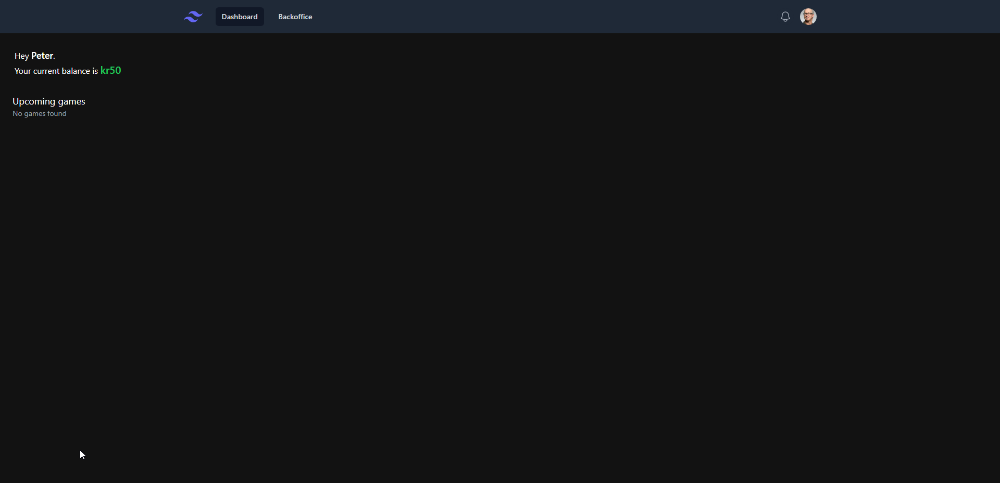

# Vinlotteri frontend

<https://begj.github.io/vinlotteri-frontend/>

## Responsive design (tailwind ui component implemented in angular and tailwind)

## Backoffice

Administrering av spill og saldoer

## Frontoffice

Brukere kjøper lodd og ser egen saldo.

## Keycloak auth

## Development server

Run `ng serve` for a dev server. Navigate to `http://localhost:4200/`. The application will automatically reload if you change any of the source files.

## Deploy to github pages

Run `ng deploy --base-href=/vinlotteri-frontend/` to build prod and deploy automatically to github pages.

Based on [this guide](https://www.syncfusion.com/blogs/post/easy-steps-to-host-an-angular-app-in-github-pages.aspx)

## Code scaffolding

Run `ng generate component component-name` to generate a new component. You can also use `ng generate directive|pipe|service|class|guard|interface|enum|module`.

## Build

Run `ng build` to build the project. The build artifacts will be stored in the `dist/` directory.

## Running unit tests

Run `ng test` to execute the unit tests via [Karma](https://karma-runner.github.io).

## Running end-to-end tests

Run `ng e2e` to execute the end-to-end tests via a platform of your choice. To use this command, you need to first add a package that implements end-to-end testing capabilities.

## Further help

To get more help on the Angular CLI use `ng help` or go check out the [Angular CLI Overview and Command Reference](https://angular.io/cli) page.
